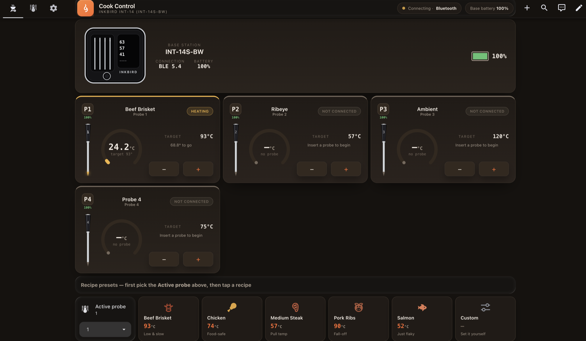

<h1 align="center">🔥 Inkbird BBQ Dashboard</h1>

<p align="center">
  A Home Assistant dashboard for the <b>Inkbird INT-14S-BW</b> wireless BBQ thermometer —<br>
  four live probe gauges, recipe presets and a "your meat is ready" notification.
</p>

<p align="center">
  
  
  
</p>



> 📸 _Screenshots live in [`docs/images/`](docs/images/). If you are reading this
> straight after cloning, drop your own `cook-control.png` and `settings.png` in
> there — see [`docs/images/README.md`](docs/images/README.md)._

---

## ✨ What you get

| | |
|---|---|
| 🌡️ **Four probe cards** | Live temperature on a 270° arc gauge, colour-coded by state — grey `idle` · amber `heating` · orange `close` · green `ready` |
| 🔋 **Per-probe battery** | Each card shows its probe's battery as a bar + percentage, red below 20 %, amber below 40 % |
| 📶 **Real connection status** | The header pill reads the actual transport — *Live · Bluetooth*, a pulsing *Connecting*, or red *Offline* — instead of assuming everything is fine |
| 🥩 **Recipe presets** | One tap writes name + target onto the selected probe: Brisket 93 °C, Chicken 74 °C, Medium Steak 57 °C, Pork Ribs 90 °C, Salmon 52 °C |
| 🔔 **Ready notification** | Persistent notification plus an optional phone/watch/TV target you pick from a dropdown |
| 🎛️ **Base station card** | Battery level and an SVG rendering of the INT-14 base |
| 🚨 **Alerts card** | Rolls every probe that is `close` or `ready` into one summary at the top |
| 🇺🇸 **°C / °F toggle** | Display-only unit switch — no need to reconfigure the device |
| ⚙️ **Settings subview** | Integration version + update button, unit and notification pickers, handy links |

## 📋 Requirements

| Requirement | Where to get it |
|---|---|
| Inkbird **INT-14S-BW** (or a sibling INT-14 model) | [inkbird.com](https://inkbird.com) |
| **Inkbird INT** custom integration (`inkbird_int14`) | [zampix1/ha-inkbird-int14](https://github.com/zampix1/ha-inkbird-int14) — install via HACS as a custom repository |
| **button-card** | [custom-cards/button-card](https://github.com/custom-cards/button-card) — HACS → Frontend |
| **card-mod** | [thomasloven/lovelace-card-mod](https://github.com/thomasloven/lovelace-card-mod) — HACS → Frontend |
| A Bluetooth adapter or ESPHome BT proxy in range of the base station | — |

## 🚀 Install

### 1. Add the backend (helpers, script, automation)

Copy [`packages/inkbird_bbq.yaml`](packages/inkbird_bbq.yaml) to `<config>/packages/inkbird_bbq.yaml`, then make sure your `configuration.yaml` has:

```yaml
homeassistant:
  packages: !include_dir_named packages
```

Check the config under **Developer Tools → YAML** and restart Home Assistant. That one file creates every helper, the four status sensors, the recipe script and the notification automation.

<details>
<summary>Prefer clicking things? Create the helpers through the UI instead</summary>

Everything in the package can equally be built under **Settings → Devices & Services → Helpers**. [`docs/HELPERS.md`](docs/HELPERS.md) lists each entity with the exact fields to fill in.

</details>

### 2. Add the dashboard

**Settings → Dashboards → + Add dashboard → New dashboard from scratch.** Name it so the URL becomes `/dashboard-bbq` — the Settings and Back buttons navigate to `/dashboard-bbq/cook` and `/dashboard-bbq/settings`.

Open it, then **✏️ Edit → ⋮ → Raw configuration editor**, and paste the contents of [`dashboard/bbq-dashboard.yaml`](dashboard/bbq-dashboard.yaml).

> Using a different URL? Search the dashboard file for `/dashboard-bbq/` and replace both occurrences.

### 3. Adapt the entity ids

The dashboard and the package reference the probe sensors as they were named on the source install:

```
sensor.overig_inkbird_int_14_probe_1_food_1_temperature
sensor.overig_inkbird_int_14_base_battery
```

The `overig_` prefix comes from the *area* the device was assigned to, so yours will almost certainly differ. Find your names under **Developer Tools → States** (filter on `inkbird`), then search-and-replace in both files:

| Placeholder in this repo | Replace with |
|---|---|
| `sensor.overig_inkbird_int_14_probe_N_food_1_temperature` | your probe *N* food temperature sensor |
| `sensor.overig_inkbird_int_14_probe_N_battery` | your probe *N* battery sensor |
| `sensor.overig_inkbird_int_14_base_battery` | your base station battery sensor |
| `update.inkbird_int_update` | your integration's update entity |

`sensor.inkbird_int_14_active_transport` and `binary_sensor.inkbird_int_14_ble_connected` (used by the connection pill) are **not** area-prefixed, so those usually work as-is.

### 4. Point notifications at your phone

Out of the box only a persistent notification is sent. To also ping a device, add a branch to the `choose:` block at the bottom of `packages/inkbird_bbq.yaml` and add the matching option to `input_select.bbq_notificatie_apparaat`. A worked example is in [`docs/HELPERS.md`](docs/HELPERS.md#notification-routing).

## 📁 Repo layout

```
inkbird-dashboard/
├── packages/
│   └── inkbird_bbq.yaml       # ← drop into <config>/packages/ — helpers, sensors, script, automation
├── dashboard/
│   ├── bbq-dashboard.yaml     # ← paste into the raw configuration editor
│   └── bbq-dashboard.json     # same config, exact storage-mode export (for diffing / the HA API)
├── docs/
│   ├── HELPERS.md             # every entity explained, for UI-based setup
│   └── images/                # screenshots
├── TODO.md                    # ideas and planned improvements
└── README.md
```

`bbq-dashboard.yaml` and `bbq-dashboard.json` hold **identical** content — pick whichever your workflow needs.

## 🍖 Customising the recipes

Recipes are plain cards in the dashboard file. Copy a block, change the four variables:

```yaml
- type: custom:button-card
  template: inkbird_recipe
  name: Lamb Shoulder
  variables:
    rname: Lamb Shoulder   # written to the probe's name
    temp: 88               # target in °C
    note: Pull temp        # small caption
    color: '#b0442a'       # icon colour
```

Tapping a preset applies it to whichever probe is chosen in the **Active probe** selector, so pick that first.

## 🙏 Credits & sources

This dashboard stands on other people's work:

- **[Home Assistant](https://www.home-assistant.io/)** — the platform everything runs on.
- **[zampix1/ha-inkbird-int14](https://github.com/zampix1/ha-inkbird-int14)** — the `inkbird_int14` custom integration that talks to the thermometer over BLE. Without it there are no probe sensors and this dashboard has nothing to show. All device communication, probe mapping and the update entity come from there.
- **[custom-cards/button-card](https://github.com/custom-cards/button-card)** by RomRider — every probe card, the header, the base-station card and the recipe buttons are `custom:button-card` templates. The gauges and device illustrations are inline SVG rendered through its `custom_fields`.
- **[thomasloven/lovelace-card-mod](https://github.com/thomasloven/lovelace-card-mod)** — restyles the stock markdown and grid cards to match the dark charcoal/ember theme.
- **[Material Design Icons](https://pictogrammers.com/library/mdi/)** — the `mdi:` icons.
- **Inkbird** — the [INT-14S-BW](https://inkbird.com) hardware and its display, which the base-station SVG is drawn after.
- The settings-page layout (version tile + link card built from Jinja variables) reuses the pattern from the author's Zendure configuration dashboard.

Not affiliated with or endorsed by Inkbird. "Inkbird" and "INT-14S-BW" are trademarks of their respective owner; this is an unofficial community dashboard.

## 📦 Is this installable from HACS?

Not today, and not without a rewrite — HACS has no repository type for a Lovelace dashboard config. Its "Dashboard" category installs **JavaScript** cards into `www/community/`, not view layouts. The two custom cards this dashboard *depends on* (button-card, card-mod) come from HACS; the dashboard itself is copy-paste.

The route to a real one-click install is to ship this as a **dashboard strategy** — a JS module that generates the views at render time, installs through HACS like any other frontend resource, and could discover your Inkbird entities automatically instead of making you search-and-replace entity ids. See [`TODO.md`](TODO.md#hacs-compatibility) for the trade-offs.

## 🗺️ Roadmap

Ideas, known gaps and nice-to-haves live in [`TODO.md`](TODO.md). Suggestions and PRs welcome.

## 📄 License

[MIT](LICENSE) — do what you like with it. Cook something good.
