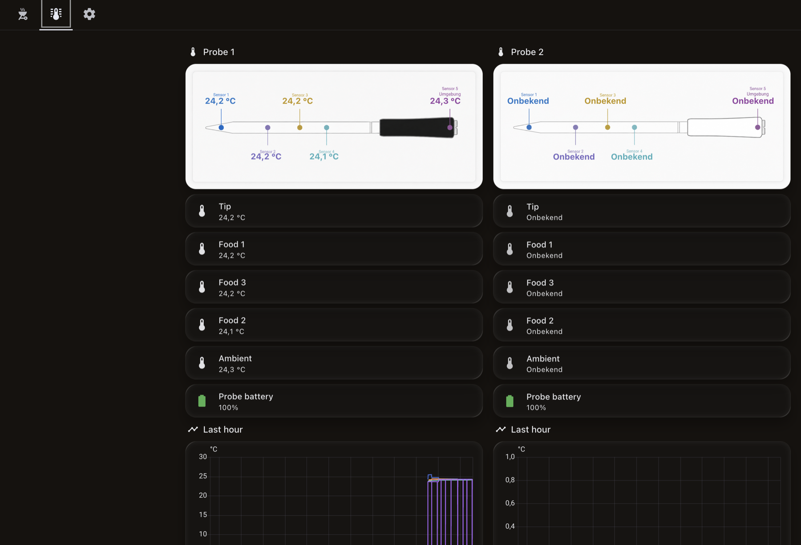
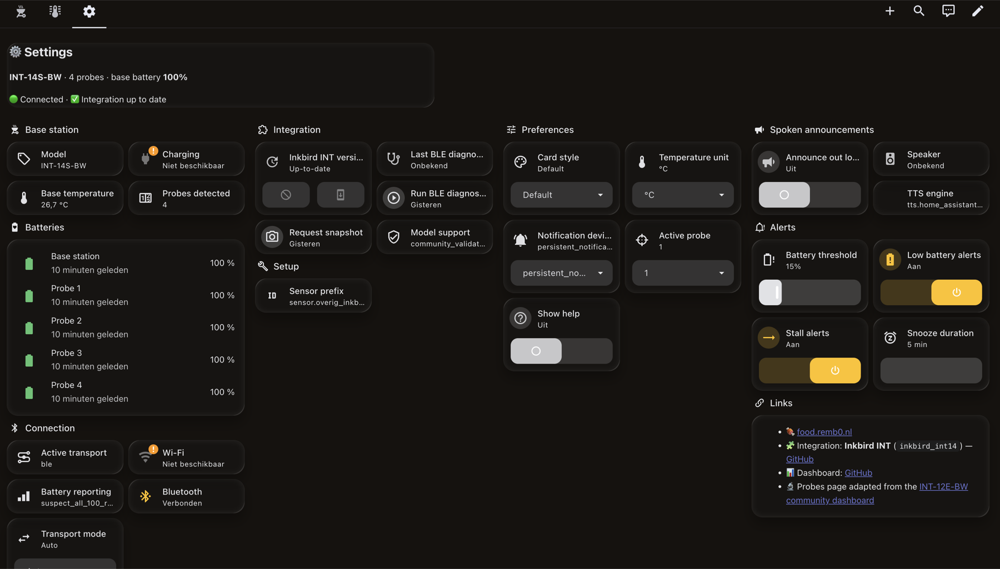

<h1 align="center">🔥 Inkbird BBQ Dashboard</h1>

<p align="center">
  A Home Assistant dashboard for the <b>Inkbird INT-14S-BW</b> wireless BBQ thermometer.<br>
  Live probe gauges with an ETA, recipe presets, stall detection, and a push you can snooze.
</p>

<p align="center">
  <a href="https://my.home-assistant.io/redirect/hacs_repository/?owner=remb0&repository=inkbird-dashboard&category=plugin"></a>
</p>

<p align="center">
  
  
  
  
</p>

<p align="center">
  <sub>Opens HACS on your own instance with this repository pre-filled.<br>
  Manual equivalent: <b>HACS → ⋮ → Custom repositories</b> →
  <code>remb0/inkbird-dashboard</code>, type <b>Dashboard</b>.</sub>
</p>

<!-- SCREENSHOTS:START -->
<p align="center">
  
</p>

<details>
<summary align="center">More screenshots</summary>

<p align="center">
  
</p>

<p align="center">
  
</p>

</details>
<!-- SCREENSHOTS:END -->

---

## ✨ What you get

| | |
|---|---|
| 🌡️ **Four probe cards** | Live temperature on a 270° arc gauge, colour-coded by state — grey `idle` · amber `heating` · orange `close` · green `ready` |
| 🔋 **Per-probe battery** | A bare colour-coded percentage under each card's P1–P4 badge — red below 20 %, amber below 40 % |
| 📶 **Real connection status** | The header pill reads the actual transport — *Live · Bluetooth*, a pulsing *Connecting*, or red *Offline* — instead of assuming everything is fine |
| 🥩 **Recipe presets** | One tap writes name + target onto the selected probe — 🐄 Brisket 93 °C, 🍗 Chicken 74 °C, 🥩 Medium Steak 57 °C, 🐖 Pork Ribs 90 °C, 🐟 Salmon 52 °C |
| 🧪 **Custom recipe** | A sixth button opens a form: name, target, probe, rest reminder, where to notify and whether to announce it |
| 🥗 **Rest reminder** | Optional second alert once the meat has rested — carryover cooking means "ready" is not "serve now" |
| 🔔 **Ready notification** | Persistent notification plus an optional phone/watch/TV target, with **Snooze** and **Dismiss** buttons on the push |
| 🔊 **Spoken announcements** | Optional TTS to any speaker — "Your Beef Brisket is ready" — with its own wording, not the emoji version |
| ⏳ **ETA to target** | "≈ 1 h 40 m" on each probe card, from a rate-of-change sensor rather than a guess |
| 😐 **Stall detection** | Tells you when a probe has been flat for 45 minutes while still climbing — the moment you decide whether to wrap |
| 🪫 **Low battery alerts** | Warns before a probe quits at hour six, with a threshold you set and a toggle to silence it |
| 🎛️ **Base station card** | Battery level and an SVG rendering of the INT-14 base |
| 🚨 **Alerts card** | Rolls every probe that is `close` or `ready` into one summary at the top, and hides itself when there is nothing to say |
| 🇺🇸 **°C / °F toggle** | Display-only unit switch — no need to reconfigure the device |
| 🔬 **Probes page** | All five channels of every probe — tip, three food points and ambient — laid over probe artwork, plus per-channel tiles and a one-hour history graph |
| ⚙️ **Settings page** | Live device summary over nine sections — device, connection, batteries, preferences, alerts, announcements, integration health, links and setup |

### Pages

All three are tabs in the dashboard's own menu — there is no hidden subview and no in-card navigation button to hunt for.

| Page | Path | What it's for |
|---|---|---|
| **Cook Control** | `/dashboard-bbq/cook` | The cooking view — four probe gauges, alerts, recipe presets |
| **Probes** | `/dashboard-bbq/probes` | The diagnostic view — every channel of every probe, with history |
| **Settings** | `/dashboard-bbq/settings` | Device health, preferences, integration status and links |

Cook Control answers "is it done yet?" at a glance. Probes answers "what is actually going on inside this piece of meat?" — a brisket with the tip in the flat and the ambient sensor in the pit tells you far more than one number. Settings answers "why is it not working?" before you go digging in the integration's own pages.

<details>
<summary>What's on the Settings page</summary>

A live header line (model · probe count · base battery · connection · whether an integration update is waiting), then:

In the order they appear:

| Section | Shows |
|---|---|
| **Base station** | Model, charging state, base temperature, probes detected |
| **Connection** | Transport mode selector, active transport, Bluetooth and Wi-Fi connectivity, battery-reporting freshness |
| **Batteries** | Base station and all four probes in one `battery-state-card`, colour-graded by level |
| **Preferences** | Temperature unit, **card style** (solid or transparent), notification device, active probe, **Show help** |
| **Alerts** | Low-battery toggle + threshold slider, stall-detection toggle, snooze duration |
| **Spoken announcements** | TTS on/off, speaker and engine |
| **Integration** | Version + update button, model support status, last BLE diagnostic, and buttons to run a diagnostic or request a snapshot |
| **Links** | Integration, dashboard and the community dashboard the Probes page came from |
| **Setup** | Sensor prefix — retarget the dashboard at a different Inkbird without editing files |

Turning **Show help** on reveals a paragraph under Alerts, Spoken announcements and Setup explaining what each one actually does — handy the first time, out of the way afterwards.

It is a native `sections` view built from stock cards — no `card-mod`, so it survives Home Assistant upgrades better than the Cook Control page does.

</details>

## 📋 Requirements

| Requirement | Where to get it |
|---|---|
| Inkbird **INT-14S-BW** (or a sibling INT-14 model) | [inkbird.com](https://inkbird.com) |
| **Inkbird INT** custom integration (`inkbird_int14`) | [zampix1/ha-inkbird-int14](https://github.com/zampix1/ha-inkbird-int14) — install via HACS as a custom repository |
| Three frontend cards | button-card, card-mod, battery-state-card — all from HACS. [Step 1](#1-frontend-cards--needed-either-way) has the links |
| A Bluetooth adapter or ESPHome BT proxy in range of the base station | — |

## 🚀 Install

> **Use HACS.** It installs the dashboard, keeps it updated, and **discovers your Inkbird entity ids by itself** — nothing to search-and-replace. The manual route does the same job by hand and is kept for people who would rather see exactly what they are pasting.

### 1. Frontend cards — needed either way

Install all three from **HACS → Frontend**:

| Card | Used by |
|---|---|
| [button-card](https://github.com/custom-cards/button-card) | Probe gauges, header, recipe buttons |
| [card-mod](https://github.com/thomasloven/lovelace-card-mod) | The dark theme and the responsive grids |
| [battery-state-card](https://github.com/maxwroc/battery-state-card) | The Batteries section on Settings |

### 2. The dashboard

<table><tr><td>

**⭐ Recommended — install this repo from HACS**

[](https://my.home-assistant.io/redirect/hacs_repository/?owner=remb0&repository=inkbird-dashboard&category=plugin)

Or by hand: **HACS → ⋮ → Custom repositories** → `remb0/inkbird-dashboard`, type **Dashboard**.

Install it, then **reload your browser**.

Now **Settings → Dashboards → + Add dashboard → New dashboard from scratch**. Open it, then **✏️ Edit → ⋮ → Raw configuration editor**, and paste exactly this:

```yaml
strategy:
  type: custom:inkbird-bbq
views: []
```

That is the entire dashboard config. The strategy builds all three views at render time and finds your entity ids in the entity registry, so **you can skip step 3 completely**.

If discovery guesses wrong — more than one Inkbird, or an unusual naming scheme — pin it:

```yaml
strategy:
  type: custom:inkbird-bbq
  prefix: sensor.kitchen_inkbird_int_14
views: []
```

Updates then arrive through HACS instead of a re-paste.

</td></tr></table>

<details>
<summary><b>Manual alternative — paste the YAML</b></summary>

**Settings → Dashboards → + Add dashboard → New dashboard from scratch.** Open it, then **✏️ Edit → ⋮ → Raw configuration editor**, and paste the contents of [`dashboard/bbq-dashboard.yaml`](dashboard/bbq-dashboard.yaml).

Nothing in the config hardcodes the dashboard URL, so any name works. You **do** need step 3 to point it at your entity ids, and updates mean pasting again.

</details>

The three views appear as tabs either way.

### 3. Point it at your entity ids — manual route only

> Skip this if you installed from HACS. The strategy already did it.

The Inkbird integration prefixes entity ids with the **area** the device sits in — `sensor.overig_inkbird_int_14_…` here, almost certainly something else on your install. Find yours under **Developer Tools → States**, filtering on `inkbird`, then:

```bash
python3 scripts/configure.py --prefix sensor.kitchen_inkbird_int_14
```

That rewrites all three files in one pass (~175 ids) and verifies the YAML and JSON dashboards still match. Add `--dry-run` to preview.

There is also a **Sensor prefix** field on the Settings page. It re-points the probe cards, the status sensors and every automation live, with no restart — but it cannot reach the `derivative` rate sensors or the Probes page, because Home Assistant resolves a `source:` and a native card's `entity:` when the config *loads*, not when they render. The script covers those.

<details>
<summary>The other two flags</summary>

| Flag | Covers | Default in this repo |
|---|---|---|
| `--prefix` | The area-prefixed entities: every probe channel, probe batteries, base station, and the BLE diagnostic button | `sensor.overig_inkbird_int_14` |
| `--device` | Entities that are *not* area-prefixed: transport, BLE/Wi-Fi state | `inkbird_int_14` |
| `--update` | The integration's update entity | `update.inkbird_int_update` |

The script detects the current values by pattern rather than assuming, so it is safe to re-run and safe after hand edits.

</details>

### 4. The backend package — needed either way

**HACS cannot deliver a YAML package**, so this step is a file copy on both routes. Without it the dashboard renders but nothing works — no targets, no status, no alerts.

Copy [`packages/inkbird_bbq.yaml`](packages/inkbird_bbq.yaml) to `<config>/packages/inkbird_bbq.yaml`, then make sure your `configuration.yaml` has:

```yaml
homeassistant:
  packages: !include_dir_named packages
```

Check under **Developer Tools → YAML**, then restart Home Assistant. That one file creates every helper, the four status sensors, the four rate sensors, both scripts and all five automations.

<details>
<summary>Prefer clicking things? Build the helpers through the UI instead</summary>

Everything in the package can equally be built under **Settings → Devices & Services → Helpers**. [`docs/HELPERS.md`](docs/HELPERS.md) lists each entity with the exact fields to fill in.

</details>

### 5. Add the probe artwork (Probes page)

The Probes page lays temperature readings over a picture of a probe. Home Assistant serves those from `/config/www/`, and both files ship in this repo:

```bash
cp www/*.png /config/www/
```

Odd-numbered probes use the black artwork, even-numbered the white. Everything else on the page — tiles, history graphs, the temperature values themselves — works without the images; you will just get a broken-image box where the probe should be.

> The artwork is INT-12E-BW, drawn by the community contributor credited below and redistributed here under upstream's MIT licence. It is close enough to the INT-14 probes to read correctly, but it is not a picture of your exact hardware. See [`www/README.md`](www/README.md).

### 6. Point notifications at your phone

Out of the box only a persistent notification is sent. Every alert in this package routes through one script, **`script.bbq_notify`** — add a branch to its `choose:` block and a matching option to `input_select.bbq_notify_target`, and all three alerts use it. You do this once, not once per automation. A worked example is in [`docs/HELPERS.md`](docs/HELPERS.md#notification-routing).

## 📁 Repo layout

```
inkbird-dashboard/
├── packages/
│   └── inkbird_bbq.yaml       # ← drop into <config>/packages/ — helpers, sensors, scripts, automations
├── dashboard/
│   ├── bbq-dashboard.yaml     # ← paste into the raw configuration editor
│   └── bbq-dashboard.json     # same config, exact storage-mode export (for diffing / the HA API)
├── dist/
│   └── inkbird-bbq-strategy.js  # ← generated; what HACS installs
├── scripts/
│   ├── configure.py           # ← rewrite every Inkbird entity id in one command
│   ├── build_strategy.py      # regenerates dist/ from the dashboard JSON
│   ├── test_strategy.mjs      # runs the strategy against a fake install
│   └── add_screenshots.py     # wires docs/images/*.png into the README
├── www/
│   └── int12e-probe-*.png     # ← copy to <config>/www/ for the Probes page
├── docs/
│   ├── HELPERS.md             # every entity explained, for UI-based setup
│   └── images/                # screenshots
├── hacs.json                  # makes the repo installable as a HACS Dashboard
├── CHANGELOG.md               # what changed, and what breaks when you update
├── TODO.md                    # ideas and planned improvements
└── README.md
```

`bbq-dashboard.yaml` and `bbq-dashboard.json` hold **identical** content — pick whichever your workflow needs.

## 🍖 Customising the recipes

**For a one-off, just use the Custom button** on Cook Control — name, target, probe, rest reminder and notification, no file editing.

To add a *permanent* preset, copy a block in the dashboard file:

```yaml
- type: custom:button-card
  template: inkbird_recipe
  name: Lamb Shoulder
  icon: mdi:sheep            # any mdi icon
  variables:
    rname: Lamb Shoulder     # written to the probe's name
    temp: 88                 # target in °C
    note: Pull temp          # small caption
    color: '#b0442a'         # icon colour
```

Tapping a preset applies it to whichever probe is chosen in the **Active probe** selector, so pick that first. Targets are always written in °C; the °F toggle converts for display only.

Editing the dashboard by hand and installing through HACS are not exclusive — but the strategy serves the *generated* config, so a permanent preset means editing `dashboard/bbq-dashboard.yaml` and re-running `python3 scripts/build_strategy.py`.

## 🙏 Credits & sources

This dashboard stands on other people's work:

- **[Home Assistant](https://www.home-assistant.io/)** — the platform everything runs on.
- **[zampix1/ha-inkbird-int14](https://github.com/zampix1/ha-inkbird-int14)** — the `inkbird_int14` custom integration that talks to the thermometer over BLE. Without it there are no probe sensors and this dashboard has nothing to show. All device communication, probe mapping and the update entity come from there.
- **[custom-cards/button-card](https://github.com/custom-cards/button-card)** by RomRider — every probe card, the header, the base-station card and the recipe buttons are `custom:button-card` templates. The gauges and device illustrations are inline SVG rendered through its `custom_fields`.
- **[thomasloven/lovelace-card-mod](https://github.com/thomasloven/lovelace-card-mod)** — restyles the stock markdown and grid cards to match the dark charcoal/ember theme.
- **[@Nexus1212](https://github.com/Nexus1212)** — the **Probes** page is a direct adaptation of their INT-12E-BW community dashboard, shared in [Discussion #3](https://github.com/zampix1/ha-inkbird-int14/discussions/3#discussioncomment-17664834) and documented at [`docs/int12e_dashboard.md`](https://github.com/zampix1/ha-inkbird-int14/blob/main/docs/int12e_dashboard.md). The channel order, the label colours, the percentage positions of each reading and the probe artwork are all theirs; this repo only extends the single-probe card to all four INT-14 probes. It uses stock Home Assistant cards — no custom frontend card needed.
- **[maxwroc/battery-state-card](https://github.com/maxwroc/battery-state-card)** — the Batteries section on the Settings page.
- **[Material Design Icons](https://pictogrammers.com/library/mdi/)** — the `mdi:` icons.
- **Inkbird** — the [INT-14S-BW](https://inkbird.com) hardware and its display, which the base-station SVG is drawn after.
- The settings-page layout (version tile + link card built from Jinja variables) reuses the pattern from the author's Zendure configuration dashboard.

Not affiliated with or endorsed by Inkbird. "Inkbird" and "INT-14S-BW" are trademarks of their respective owner; this is an unofficial community dashboard.

## 📦 How the HACS install works

HACS has no repository type for a Lovelace *config*, so shipping the YAML through it was never possible. What it does carry is JavaScript — and a **dashboard strategy** is JavaScript that generates a dashboard at render time. That is the trick this repo uses.

[`dist/inkbird-bbq-strategy.js`](dist/inkbird-bbq-strategy.js) is **generated, not hand-written**. [`scripts/build_strategy.py`](scripts/build_strategy.py) builds it from `dashboard/bbq-dashboard.json`, replacing the install-specific entity ids with tokens that the strategy resolves against your entity registry. One source of truth, so the YAML and the strategy cannot disagree.

```bash
python3 scripts/build_strategy.py
node scripts/test_strategy.mjs     # loads it, feeds it a fake HA, checks every id resolved
```

CI fails if `dist/` is stale or the strategy stops resolving ids.

> **Note on the install link:** HACS's category enum is `appdaemon`, `integration`, `plugin`, `python_script`, `template`, `theme`. The UI calls this type **Dashboard**, but the URL parameter is still `plugin` — `category=dashboard` returns *"Repository not found"*.

It still needs button-card, card-mod and battery-state-card — the strategy generates a config that uses them, it does not render anything itself. Dropping that dependency means writing real custom card elements, which is on the roadmap.

## 🗺️ Roadmap

Ideas, known gaps and nice-to-haves live in [`TODO.md`](TODO.md). Suggestions and PRs welcome.

## 📄 License

[MIT](LICENSE) — do what you like with it. Cook something good.
